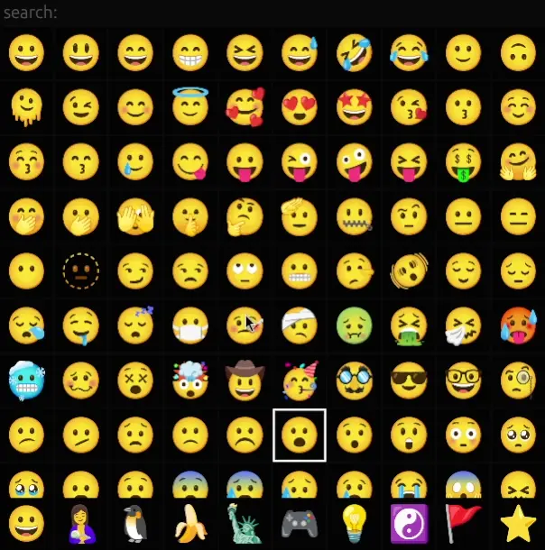

# Orpheus

emoji picker rewritten from c + x11 to rust + egui

## Demo

<div align="center">
    
    <br />
    click to copy
</div>

## Install

you need `cargo` for compiling the app\
you also need to have [xclip](https://github.com/astrand/xclip) installed for copying to clipboard

```bash
git clone https://github.com/i007c/orpheus.git
cd orpheus
cargo run -r
```
